# Дипломный практикум в Yandex.Cloud
  * [Цели:](#цели)
  * [Этапы выполнения:](#этапы-выполнения)
     * [Создание облачной инфраструктуры](#создание-облачной-инфраструктуры)
     * [Создание Kubernetes кластера](#создание-kubernetes-кластера)
     * [Создание тестового приложения](#создание-тестового-приложения)
     * [Подготовка cистемы мониторинга и деплой приложения](#подготовка-cистемы-мониторинга-и-деплой-приложения)
     * [Установка и настройка CI/CD](#установка-и-настройка-cicd)
  * [Что необходимо для сдачи задания?](#что-необходимо-для-сдачи-задания)
  * [Как правильно задавать вопросы дипломному руководителю?](#как-правильно-задавать-вопросы-дипломному-руководителю)

**Перед началом работы над дипломным заданием изучите [Инструкция по экономии облачных ресурсов](https://github.com/netology-code/devops-materials/blob/master/cloudwork.MD).**

--- 
## Цели:
 
1. Подготовить облачную инфраструктуру на базе облачного провайдера Яндекс.Облако.
2. Запустить и сконфигурировать Kubernetes кластер.
3. Установить и настроить систему мониторинга.
4. Настроить и автоматизировать сборку тестового приложения с использованием Docker-контейнеров.
5. Настроить CI для автоматической сборки и тестирования.
6. Настроить CD для автоматического развёртывания приложения. 

---
## Этапы выполнения:


### Создание облачной инфраструктуры

Для начала необходимо подготовить облачную инфраструктуру в ЯО при помощи [Terraform](https://www.terraform.io/).

Особенности выполнения:

- Бюджет купона ограничен, что следует иметь в виду при проектировании инфраструктуры и использовании ресурсов;
Для облачного k8s используйте региональный мастер(неотказоустойчивый). Для self-hosted k8s минимизируйте ресурсы ВМ и долю ЦПУ. В обоих вариантах используйте прерываемые ВМ для worker nodes.

Предварительная подготовка к установке и запуску Kubernetes кластера.

1. Создайте сервисный аккаунт, который будет в дальнейшем использоваться Terraform для работы с инфраструктурой с необходимыми и достаточными правами. Не стоит использовать права суперпользователя
2. Подготовьте [backend](https://www.terraform.io/docs/language/settings/backends/index.html) для Terraform:  
   а. Рекомендуемый вариант: S3 bucket в созданном ЯО аккаунте(создание бакета через TF)
   б. Альтернативный вариант:  [Terraform Cloud](https://app.terraform.io/)  
3. Создайте VPC с подсетями в разных зонах доступности.
4. Убедитесь, что теперь вы можете выполнить команды `terraform destroy` и `terraform apply` без дополнительных ручных действий.
5. В случае использования [Terraform Cloud](https://app.terraform.io/) в качестве [backend](https://www.terraform.io/docs/language/settings/backends/index.html) убедитесь, что применение изменений успешно проходит, используя web-интерфейс Terraform cloud.

Ожидаемые результаты:

1. Terraform сконфигурирован и создание инфраструктуры посредством Terraform возможно без дополнительных ручных действий.
2. Полученная конфигурация инфраструктуры является предварительной, поэтому в ходе дальнейшего выполнения задания возможны изменения.

### Решение:

1.  рамках выполнения данной задачи мы создадим сервисный аккаунт, который будет использоваться Terraform для управления инфраструктурой с необходимыми правами доступа. Для упрощения работы подготовим следующий скрипт::

```
Этот скрипт удаляет существующий сервисный аккаунт с именем sa-robot, создает новый и назначает ему необходимые роли для работы с ресурсами. Также он генерирует ключи доступа и сохраняет их в виде переменных окружения.
#!/bin/sh

yc iam service-account delete sa-robot
yc iam service-account create --name sa-robot
ID_SA=`yc iam service-account list | grep 'sa-robot' | awk '{print $2}'`
yc resource-manager folder add-access-binding --id b1g0jjnic75phgkajfgn --role editor --service-account-id $ID_SA
yc resource-manager folder add-access-binding --id b1g0jjnic75phgkajfgn --role storage.admin --service-account-id $ID_SA
yc resource-manager folder add-access-binding --id b1g0jjnic75phgkajfgn --role container-registry.admin --service-account-id $ID_SA
yc iam access-key create --service-account-id $ID_SA --format json > ~/.ssh/sa-key.json
yc iam key create --service-account-id $ID_SA --format json --output ~/.ssh/key.json

ACCESS_KEY_ID=$(grep 'key_id' ~/.ssh/sa-key.json | awk '{print $2}' | tr -d \")
SECRET_ACCESS_KEY=$(grep 'secret' ~/.ssh/sa-key.json | awk '{print $2}' | tr -d \")

export AWS_ACCESS_KEY_ID=$ACCESS_KEY_ID
export AWS_SECRET_ACCESS_KEY=$SECRET_ACCESS_KEY
export TF_VAR_access_key=$ACCESS_KEY_ID
export TF_VAR_secret_key=$SECRET_ACCESS_KEY
export TF_VAR_account_id=$ID_SA
```

2. Создание bucket:

```
resource "yandex_storage_bucket" "my_bucket" {
  access_key          = var.access_key
  secret_key          = var.secret_key
  bucket              = "kshatyy3"
  default_storage_class = "STANDARD"
  acl                 = "private"
}
```

3. Мы разместим backend для Terraform в ранее созданном bucket:

```
terraform {
  backend "s3" {
    endpoints = {
      s3 = "https://storage.yandexcloud.net"
    }
    
    bucket = "kshatyy3"
    region = "ru-central1"
    key    = "terraform.tfstate"

    skip_region_validation      = true
    skip_credentials_validation  = true
    skip_requesting_account_id   = true 
    skip_s3_checksum             = true 
    skip_metadata_api_check      = true
  }
}

В данном коде мы настраиваем backend Terraform для использования Yandex Cloud Storage в качестве хранилища состояния, указывая необходимые параметры и отключая валидацию для упрощения процесса.
```

4. Для начала мы создадим VPC с подсетями, расположенными в разных зонах доступности, используя локальные переменные:

```
locals {
    vpc_zone = tolist ([
      "ru-central1-b", 
      "ru-central1-a",
      "ru-central1-d"
    ])
}
```

Теперь определим ресурсы:

```
resource "yandex_vpc_network" "network_vpc" {
  name = var.vpc_name
}

resource "yandex_vpc_subnet" "public_subnet" {
  count          = length(local.vpc_zone)
  name           = "public_${local.vpc_zone[count.index]}"
  zone           = local.vpc_zone[count.index]
  network_id     = yandex_vpc_network.network_vpc.id
  v4_cidr_blocks = [var.public_cidr[count.index]]
}
```

5.  Убедимся, что теперь команды `terraform destroy` и `terraform apply` выполняются без дополнительных действий:

```
$ terraform apply

Terraform used the selected providers to generate the following execution plan. Resource actions are indicated with the following symbols:
  + create


yandex_vpc_network.network_vpc: Creating...
yandex_vpc_network.network_vpc: Creation complete after 3s [id=abc123xyz456]
yandex_vpc_subnet.public_subnet[2]: Creating...
yandex_vpc_subnet.public_subnet[1]: Creating...
yandex_vpc_subnet.public_subnet[0]: Creating...
yandex_vpc_subnet.public_subnet[1]: Creation complete after 0s [id=def456uvw789]
yandex_vpc_subnet.public_subnet[0]: Creation complete after 1s [id=ghi789rst012]
yandex_vpc_subnet.public_subnet[2]: Creation complete after 1s [id=jkl012mno345]
```

```
$ terraform destroy
yandex_vpc_network.network_vpc: Refreshing state... [id=mno987xyz654]
yandex_vpc_subnet.public_subnet[2]: Refreshing state... [id=ijk654rty321]
yandex_vpc_subnet.public_subnet[1]: Refreshing state... [id=stu321vwx654]
yandex_vpc_subnet.public_subnet[0]: Refreshing state... [id=abc987xyz123]


Do you really want to destroy all resources?
  Terraform will destroy all your managed infrastructure, as shown above.
  There is no undo. Only 'yes' will be accepted to confirm.

  Enter a value: yes

yandex_vpc_subnet.public_subnet[1]: Destroying... [id=stu321vwx654]
yandex_vpc_subnet.public_subnet[2]: Destroying... [id=ijk654rty321]
yandex_vpc_subnet.public_subnet[0]: Destroying... [id=abc987xyz123]
yandex_vpc_subnet.public_subnet[0]: Destruction complete after 1s
yandex_vpc_subnet.public_subnet[2]: Destruction complete after 2s
yandex_vpc_subnet.public_subnet[1]: Destruction complete after 3s
yandex_vpc_network.network_vpc: Destroying... [id=mno987xyz654]
yandex_vpc_network.network_vpc: Destruction complete after 0s
```

Также предоставим скриншоты созданных ресурсов для подтверждения:

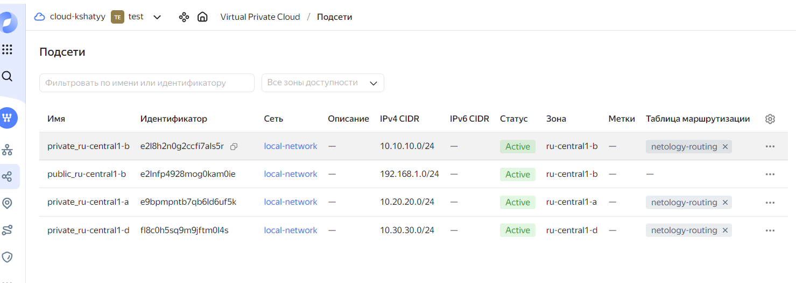

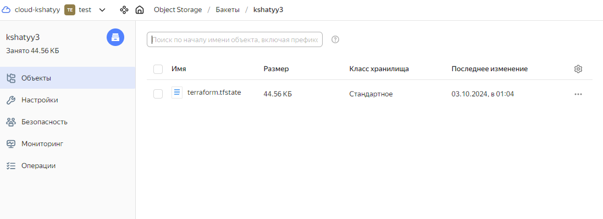


---
### Создание Kubernetes кластера

На этом этапе необходимо создать [Kubernetes](https://kubernetes.io/ru/docs/concepts/overview/what-is-kubernetes/) кластер на базе предварительно созданной инфраструктуры.   Требуется обеспечить доступ к ресурсам из Интернета.

Это можно сделать двумя способами:

1. Рекомендуемый вариант: самостоятельная установка Kubernetes кластера.  
   а. При помощи Terraform подготовить как минимум 3 виртуальных машины Compute Cloud для создания Kubernetes-кластера. Тип виртуальной машины следует выбрать самостоятельно с учётом требовании к производительности и стоимости. Если в дальнейшем поймете, что необходимо сменить тип инстанса, используйте Terraform для внесения изменений.  
   б. Подготовить [ansible](https://www.ansible.com/) конфигурации, можно воспользоваться, например [Kubespray](https://kubernetes.io/docs/setup/production-environment/tools/kubespray/)  
   в. Задеплоить Kubernetes на подготовленные ранее инстансы, в случае нехватки каких-либо ресурсов вы всегда можете создать их при помощи Terraform.
2. Альтернативный вариант: воспользуйтесь сервисом [Yandex Managed Service for Kubernetes](https://cloud.yandex.ru/services/managed-kubernetes)  
  а. С помощью terraform resource для [kubernetes](https://registry.terraform.io/providers/yandex-cloud/yandex/latest/docs/resources/kubernetes_cluster) создать **региональный** мастер kubernetes с размещением нод в разных 3 подсетях      
  б. С помощью terraform resource для [kubernetes node group](https://registry.terraform.io/providers/yandex-cloud/yandex/latest/docs/resources/kubernetes_node_group)
  
Ожидаемый результат:

1. Работоспособный Kubernetes кластер.
2. В файле `~/.kube/config` находятся данные для доступа к кластеру.
3. Команда `kubectl get pods --all-namespaces` отрабатывает без ошибок.


### Решение

1. Для обеспечения безопасности кластера мы разместим узлы в частной сети, а доступ к интернету будет осуществляться через NAT-инстанс. Подключение к узлам кластера Kubernetes также будет происходить через NAT-инстанс.

2. Определим маршрутизацию в routing.tf:

```
resource "yandex_vpc_route_table" "netology-routing" {
  name       = "netology-routing"
  network_id = yandex_vpc_network.network_vpc.id
  static_route {
    destination_prefix = "0.0.0.0/0"
    next_hop_address   = "192.168.1.254"
  }
}
```

3. Обновим файл vpc.tf следующим образом:

```
resource "yandex_vpc_network" "network_vpc" {
  name = var.vpc_name
}

resource "yandex_vpc_subnet" "private_subnet" {
  count          = length(local.vpc_zone)
  name           = "private_${local.vpc_zone[count.index]}"
  zone           = local.vpc_zone[count.index]
  network_id     = yandex_vpc_network.network_vpc.id
  v4_cidr_blocks = [var.private_cidr[count.index]]
  route_table_id = yandex_vpc_route_table.netology-routing.id
}

resource "yandex_vpc_subnet" "public_subnet" {
  name           = "public_${local.vpc_zone[0]}"
  zone           = local.vpc_zone[0]
  network_id     = yandex_vpc_network.network_vpc.id
  v4_cidr_blocks = var.public_cidr
}

```
4. Определим NAT-инстанс в файле nat-instance.tf:

```
resource "yandex_compute_instance" "nat-instance" {
  name = "nat-instance"
  hostname = "nat-instance"
  zone     = local.vpc_zone[0]
   resources {
   cores=var.vms_resources.nat_vm.cores
   memory=var.vms_resources.nat_vm.memory
   core_fraction=var.vms_resources.nat_vm.core_fraction
  }
  boot_disk {
    initialize_params {
      image_id = "fd80mrhj8fl2oe87o4e1"
    }
  }
  
  scheduling_policy {
    preemptible = true
  }

  network_interface {
    subnet_id = yandex_vpc_subnet.public_subnet.id
    ip_address = "192.168.1.254"
    nat       = true
  }
  metadata = local.metadata_vm
}
```

5. Для выполнения задания потребуется три рабочих узла, распределенных по разным подсетям:

```
resource "yandex_compute_instance" "workers" {
  count = length(local.vpc_zone)
  name  = "worker-${count.index+1}"
  hostname = "worker-${count.index+1}"
  zone     = local.vpc_zone[count.index]
   resources {
   cores=var.vms_resources.workers_vm.cores
   memory=var.vms_resources.workers_vm.memory
   core_fraction=var.vms_resources.workers_vm.core_fraction
  }
  platform_id = var.platform_id
  boot_disk {
    initialize_params {
      image_id = "fd8j0uq7qcvtb65fbffl"
      size     = 15
    }
  }
  scheduling_policy {
    preemptible = true
  }

  network_interface {
    subnet_id = yandex_vpc_subnet.private_subnet[count.index].id
    nat       = false
  }
  metadata = local.metadata_vm
}
```

6. Нужно как минимум один мастер-узел:

```
resource "yandex_compute_instance" "masters" {
  name  = "master-1"
  hostname = "master-1"
  zone     = local.vpc_zone[0]
   resources {
   cores=var.vms_resources.masters_vm.cores
   memory=var.vms_resources.masters_vm.memory
   core_fraction=var.vms_resources.masters_vm.core_fraction
  }
  platform_id = var.platform_id
  boot_disk {
    initialize_params {
      image_id = "fd8j0uq7qcvtb65fbffl"
      size     = 15
    }
  }
  scheduling_policy {
    preemptible = true
  }

  network_interface {
    subnet_id = yandex_vpc_subnet.private_subnet[0].id
    nat       = false
    
  }
  metadata = local.metadata_vm
}
```

7. Для создания инвентаря воспользуемся шаблоном Terraform:

```
---
all:
  vars:
    ansible_ssh_user: ubuntu
    ansible_ssh_private_key_file: ~/.ssh/id_rsa
    ansible_ssh_common_args: '-o ProxyCommand="ssh -W %h:%p -q -o UserKnownHostsFile=/dev/null -o StrictHostKeyChecking=no ubuntu@${nat-instance["network_interface"][0]["nat_ip_address"]} -i {{ ansible_ssh_private_key_file }}"'
    become: true
    ansible_python_interpreter: /usr/bin/python3

  hosts: 
    %{~ for instance in masters + workers ~}
    ${instance["name"]}:
      ansible_host: ${instance["network_interface"][0]["nat_ip_address"] == "" ? instance["network_interface"][0]["ip_address"] : instance["network_interface"][0]["nat_ip_address"]}
      ip: ${instance["network_interface"][0]["ip_address"]}
      access_ip: ${instance["network_interface"][0]["ip_address"]}
    %{~ endfor ~}

  children:
    kube_control_plane:
      hosts:
        %{~ for master in masters ~}
        ${master["name"]}:
        %{~ endfor ~}
        
    kube_node:
      hosts:
        %{~ for worker in workers ~}
        ${worker["name"]}:
        %{~ endfor ~}

    etcd:
      hosts:
        %{~ for master in masters ~}
        ${master["name"]}:
        %{~ endfor ~}

    k8s_cluster:
      children:
        kube_control_plane:
        kube_node:

    calico_rr:
      hosts: {}

```

8. Чтобы избежать ошибок в последних версиях Kubespray, создадим файл конфигурации ansible.cfg и разместим его в каталоге с кодом Terraform:

```
[defaults]
library = ..ansible/kubespray/library
roles_path = ../ansible/kubespray/roles
```

9. Определим переменные для ресурсов инстансов:

```
vms_resources = {
  nat_vm = { cores=2, memory=2, core_fraction=20 }
  workers_vm = { cores=2, memory=4, core_fraction=50 }
  masters_vm = { cores=2, memory=4, core_fraction=50 }
}

```

10. Создадим playbook для подготовки к разворачиванию кластера K8S:
    
```
---
- name: Prepare to install K8S
  hosts: all
  become: true
  gather_facts: false

  pre_tasks:
    - name: Wait for connection
      ansible.builtin.wait_for_connection:
        timeout: 300

  tasks:
    - name: Packages-update
      ansible.builtin.apt:
        name:
          - git
          - python3-pip
        state: present
        update_cache: true


```

11. Создадим playbook для автоматизации настройки kubeconfig:

```
- name: Cofigure K8S
  hosts: kube_control_plane
  become: true
  gather_facts: false
  tasks:

    - name: Get user home directory
      getent:
        database: passwd
        key: "{{ ansible_user }}"
      register: user_info

    - name: Extract home directory from user_info
      set_fact:
        home_dir: "{{ user_info.ansible_facts.getent_passwd.ubuntu[4] }}"

    - name: Make directory for depoy
      ansible.builtin.file:
        path: "{{ home_dir }}/.kube"
        state: directory
        mode: '0755'
        owner: "{{ ansible_user }}"
        group: "{{ ansible_user }}"

    - name: Copy config K8S
      ansible.builtin.copy:
        remote_src: true
        src: "/etc/kubernetes/admin.conf"
        dest: "{{ home_dir }}/.kube/config"
        owner: "{{ ansible_user }}"
        group: "{{ ansible_user }}"

    - name: Make directory for K8S
      ansible.builtin.file:
        path: "{{ home_dir }}/k8s"
        state: directory
        mode: '0755'
        owner: "{{ ansible_user }}"
        group: "{{ ansible_user }}"

```

12. Подготовим playbook, который будет отвечать за установку Kubernetes:

```
---
- name: Preparation and installation of K8S
  ansible.builtin.import_playbook: prepare.yml

- name: Deploy K8S
  ansible.builtin.import_playbook: kubespray/cluster.yml

- name: Transfer K8S configuration
  ansible.builtin.import_playbook: finish-k8s.yml

```

13. Опишем настройки Terraform для создания инвентаря и выполнения playbook:

```
resource "local_file" "hosts_yml" {
  depends_on = [
    yandex_compute_instance.masters,
    yandex_compute_instance.workers,
    yandex_compute_instance.nat-instance,
  ]
  content = templatefile("${path.module}/hosts.tftpl",
    {
      masters = yandex_compute_instance.masters[*],
      workers  = yandex_compute_instance.workers[*],
      nat-instance = yandex_compute_instance.nat-instance,
    })
  filename = "${abspath(path.module)}/../ansible/hosts.yml"
}

resource "null_resource" "install-k8s" {
  depends_on = [
    yandex_compute_instance.masters,
    yandex_compute_instance.workers,
    yandex_compute_instance.nat-instance,
  ]
  
  provisioner "local-exec" {
    command = "export ANSIBLE_HOST_KEY_CHECKING=False; ansible-playbook -i ../ansible/hosts.yml -b ../ansible/install-k8s.yml"
  }  
   
}

```

14. Запускаем команду ```terraform apply``` для создания инстансов и развертывания кластера Kubernetes..
    
15. Проверка созданных инстансов:

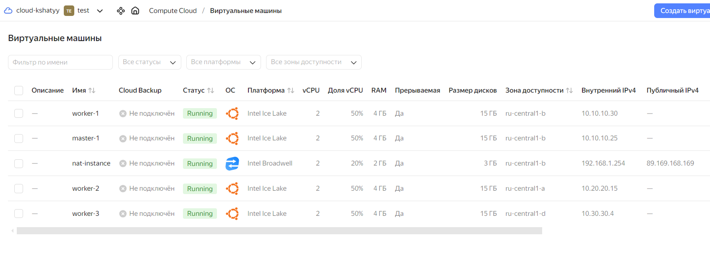

16. Обзор сетевой схемы:

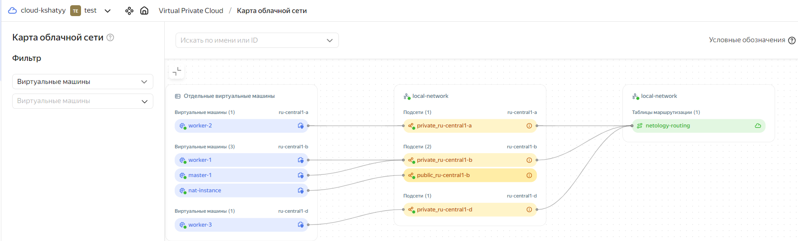


17. Вот как будет выглядеть наш inventory:

```
---
all:
  vars:
    ansible_ssh_user: ubuntu
    ansible_ssh_private_key_file: ~/.ssh/id_rsa
    ansible_ssh_common_args: '-o ProxyCommand="ssh -W %h:%p -q -o UserKnownHostsFile=/dev/null -o StrictHostKeyChecking=no ubuntu@89.169.168.169 -i ~/.ssh/id_rsa"'
    become: true


  hosts:
    master-1:
      ansible_host: 10.10.10.32
      ip: 10.0.10.32
      access_ip: 10.10.10.32
    worker-1:
      ansible_host: 10.10.10.33
      ip: 10.10.10.33
      access_ip: 10.10.10.33
    worker-2:
      ansible_host: 10.10.20.23
      ip: 10.10.20.23
      access_ip: 10.20.20.23
    worker-3:
      ansible_host: 10.30.30.11
      ip: 10.30.30.11
      access_ip: 10.30.30.11
  children:
    kube_control_plane:
      hosts:
        master-1:
    kube_node:
      hosts:
        worker-1:
        worker-2:
        worker-3:
    etcd:
      hosts:
        master-1:
    k8s_cluster:
      children:
        kube_control_plane:
        kube_node:
    calico_rr:
      hosts: {}

```

18. Подключаемся к мастер-узлу и проверяем состояние узлов от имени пользователя ubuntu:

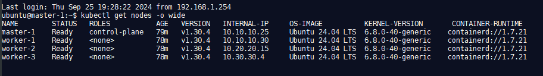


19. Теперь мы можем проверить состояние подов в кластере:

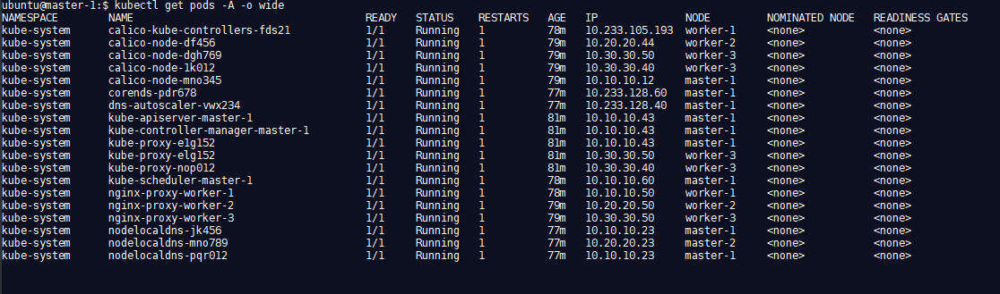


---
### Создание тестового приложения

Для перехода к следующему этапу необходимо подготовить тестовое приложение, эмулирующее основное приложение разрабатываемое вашей компанией.

Способ подготовки:

1. Рекомендуемый вариант:  
   а. Создайте отдельный git репозиторий с простым nginx конфигом, который будет отдавать статические данные.  
   б. Подготовьте Dockerfile для создания образа приложения.  
2. Альтернативный вариант:  
   а. Используйте любой другой код, главное, чтобы был самостоятельно создан Dockerfile.

Ожидаемый результат:

1. Git репозиторий с тестовым приложением и Dockerfile.
2. Регистри с собранным docker image. В качестве регистри может быть DockerHub или [Yandex Container Registry](https://cloud.yandex.ru/services/container-registry), созданный также с помощью terraform.


### Решение

1. Создание отдельного репозитория на GitHub:

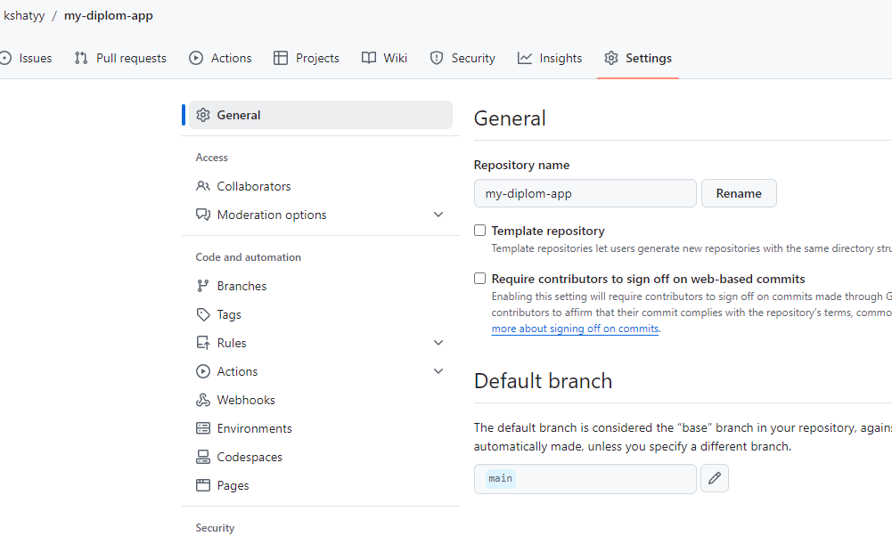

2. Далее создадим HTML-страницу для конфигурации Nginx:

```
<!DOCTYPE html>
<html lang="en" >
<head>
  <meta charset="UTF-8">
  <title>Диплом Шатый Константин</title>
  

</head>
<body>
<!-- partial:index.partial.html -->
<html><head>
		<meta charset="utf-8">
		<meta name="robots" content="noindex,nofollow">
		<meta name="viewport" content="width=device-width,maximum-scale=1,user-scalable=no,minimal-ui">
		<link rel="stylesheet" type="text/css" href="https://fonts.googleapis.com/css?family=Open+Sans:400,600,800&amp;subset=latin,latin-ext">
		<link rel="stylesheet" type="text/css" href="https://cdn.travel.sygic.com/travel.sygic.com_lp/css/404.css?9267bb3cab874302435dffd6b29bbb65e3da2cf8">
		<title>	Шатый Константин
</title>
		
	</head>
	<body>
<div class="stars"></div>

<div class="sun-moon">
	<div class="sun"></div>
	<div class="moon"></div>
</div>

<div id="js-hills" class="background hills"></div>
<div id="js-country" class="background country"></div>
<div id="js-foreground" class="background foreground"></div>

<div class="error-content">
	Дипломная работа Шатый Константин <br>
<a href="https://github.com/kshatyy">GitHub
</a>v.1.0.0
</div>


<div class="code">
	<span>D</span>
	<span>e</span>
	<span>v</span>
	<span></span>
	<span></span>
	<span></span>
	</div>
</body></html>
<!-- partial -->
  
</body>
</html>
```

3. Теперь создадим файл Dockerfile для настройки контейнера:

```
FROM nginx:1.21.1
COPY index.html /usr/share/nginx/html/index.html
EXPOSE 80
CMD ["nginx", "-g", "daemon off;"]

```

4. Добавим в конфигурацию Terraform новый файл ```registry.tf```, который позволит создать контейнерный реестр в Yandex Cloud, собрать образ и разместить его в этом реестре:

```
resource "yandex_container_registry" "my_registry" {
  name      = "my-registry"
}

# Права для извлечения образов
resource "yandex_container_registry_iam_binding" "puller" {
  registry_id = yandex_container_registry.my_registry.id
  role        = "container-registry.images.puller"

  members = [
    "system:allUsers",
  ]
}

# Права для загрузки образов
resource "yandex_container_registry_iam_binding" "pusher" {
  registry_id = yandex_container_registry.my_registry.id
  role        = "container-registry.images.pusher"

  members = [
      "system:allUsers",
  ]
}


resource "null_resource" "docker" {
  # triggers = {
  #   always_run = "${timestamp()}"
  # }
  depends_on = [yandex_container_registry.my_registry]
  
  # Создание образа контейнера
  provisioner "local-exec" {
    command = "docker build . -t cr.yandex/${yandex_container_registry.my_registry.id}/nginx:v1.0.0 -f Dockerfile"
    working_dir = "${path.root}/../docker"
  }  

  #Применение тега latest
  provisioner "local-exec" {
    command = "docker tag cr.yandex/${yandex_container_registry.my_registry.id}/nginx:v1.0.0 cr.yandex/${yandex_container_registry.my_registry.id}/nginx:latest"
  }  

  #Размещение образа в созданном реестре
  provisioner "local-exec" {
    command = "docker push cr.yandex/${yandex_container_registry.my_registry.id}/nginx:v1.0.0 && docker push cr.yandex/${yandex_container_registry.my_registry.id}/nginx:latest"
  }  
}
resource "local_file" "registry_id_file" {
  filename = "../ansible/registry_id.txt"
  content  = "my_registry_id: ${yandex_container_registry.my_registry.id}"
}

```

5. Выполним команду ```terraform apply``` для применения изменений.
6. Проверка результатов в консоли управления Yandex Cloud:

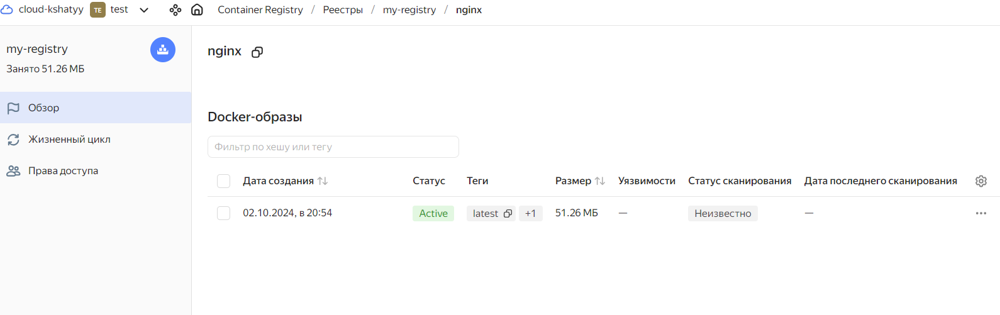


---
### Подготовка cистемы мониторинга и деплой приложения

Уже должны быть готовы конфигурации для автоматического создания облачной инфраструктуры и поднятия Kubernetes кластера.  
Теперь необходимо подготовить конфигурационные файлы для настройки нашего Kubernetes кластера.

Цель:
1. Задеплоить в кластер [prometheus](https://prometheus.io/), [grafana](https://grafana.com/), [alertmanager](https://github.com/prometheus/alertmanager), [экспортер](https://github.com/prometheus/node_exporter) основных метрик Kubernetes.
2. Задеплоить тестовое приложение, например, [nginx](https://www.nginx.com/) сервер отдающий статическую страницу.

Способ выполнения:
1. Воспользоваться пакетом [kube-prometheus](https://github.com/prometheus-operator/kube-prometheus), который уже включает в себя [Kubernetes оператор](https://operatorhub.io/) для [grafana](https://grafana.com/), [prometheus](https://prometheus.io/), [alertmanager](https://github.com/prometheus/alertmanager) и [node_exporter](https://github.com/prometheus/node_exporter). Альтернативный вариант - использовать набор helm чартов от [bitnami](https://github.com/bitnami/charts/tree/main/bitnami).

2. Если на первом этапе вы не воспользовались [Terraform Cloud](https://app.terraform.io/), то задеплойте и настройте в кластере [atlantis](https://www.runatlantis.io/) для отслеживания изменений инфраструктуры. Альтернативный вариант 3 задания: вместо Terraform Cloud или atlantis настройте на автоматический запуск и применение конфигурации terraform из вашего git-репозитория в выбранной вами CI-CD системе при любом комите в main ветку. Предоставьте скриншоты работы пайплайна из CI/CD системы.

Ожидаемый результат:
1. Git репозиторий с конфигурационными файлами для настройки Kubernetes.
2. Http доступ к web интерфейсу grafana.
3. Дашборды в grafana отображающие состояние Kubernetes кластера.
4. Http доступ к тестовому приложению.


### Решение

1. Создадим playbook, который будет использоваться для развертывания системы мониторинга::

```
- name: Install monitoring stack
  hosts: kube_control_plane
  become: false
  gather_facts: false

  tasks:

    - name: Clone kube-prometheus
      ansible.builtin.git:
        repo: https://github.com/prometheus-operator/kube-prometheus.git
        dest: kube-prometheus

    - name: Create the namespace and CRDs
      ansible.builtin.command:
        cmd: 'kubectl apply --server-side -f manifests/setup'
        chdir: 'kube-prometheus/'

    - name: Wait for namespace to be available
      ansible.builtin.command:
        cmd: 'kubectl wait --for condition=Established --all CustomResourceDefinition --namespace=monitoring'
        chdir: 'kube-prometheus/'

    - name: Deployment kube-prometheus
      ansible.builtin.command:
        cmd: 'kubectl apply -f manifests/'
        chdir: 'kube-prometheus/'
   
    - name: Copy service grafana
      ansible.builtin.copy:
        src: '../k8s/grafana-service.yml'
        dest: '~/'
        mode: '0644'

    - name: Apply service grafana
      ansible.builtin.command:
        cmd: 'kubectl apply -f ~/grafana-service.yml -n monitoring'

    - name: Copy network policy
      ansible.builtin.copy:
        src: '../k8s/grafana-networkpolicy.yml'
        dest: '~/'
    
    - name: Apply network policy for grafana
      ansible.builtin.command:
        cmd: 'kubectl apply -f ~/grafana-networkpolicy.yml -n monitoring'

```

2. Определим сервис для доступа к Grafana через NodePort:

```
---
apiVersion: v1
kind: Service
metadata:
  name: grafana-service
spec:
  selector:
    app.kubernetes.io/name: grafana
  ports:
    - name: grafana-http
      protocol: TCP
      port: 3000
      nodePort: 31000
      targetPort: 3000
  type: NodePort

```

3. Создадим политики доступа для Grafana:

```
apiVersion: networking.k8s.io/v1
kind: NetworkPolicy
metadata:
  labels:
    app.kubernetes.io/name: grafana
  name: grafana
  namespace: monitoring
spec:
  egress:
  - to:
    - ipBlock:
        cidr: 0.0.0.0/0
  ingress:
  - from:
    - ipBlock:
        cidr: 0.0.0.0/0
    - podSelector:
        matchLabels:
          app.kubernetes.io/name: prometheus
    ports:
    - port: 3000
      protocol: TCP
  podSelector:
    matchLabels:
      app.kubernetes.io/component: grafana
      app.kubernetes.io/name: grafana
      app.kubernetes.io/part-of: kube-prometheus
  policyTypes:
  - Egress
  - Ingress
```

4. Определим балансировщик нагрузки для Grafana и приложения:

```
# Создание группы целевых экземпляров
resource "yandex_lb_target_group" "nlb-group" {
  name       = "nlb-group"
  depends_on = [yandex_compute_instance.workers]
  dynamic "target" {
    for_each = yandex_compute_instance.workers
    content { 
      subnet_id = target.value.network_interface.0.subnet_id
      address   = target.value.network_interface.0.ip_address
    }
  }
}

# Создание балансировщика для Grafana и приложения
resource "yandex_lb_network_load_balancer" "nlb-grafana" {
  name = "nlb-grafana"
  listener {
    name        = "grafana-listener"
    port        = 3000
    target_port = 31000
    external_address_spec {
      ip_version = "ipv4"
    }
  }

    listener {
    name        = "app-listener"
    port        = 80
    target_port = 31080
    external_address_spec {
      ip_version = "ipv4"
    }
  }

  attached_target_group {
    target_group_id = yandex_lb_target_group.nlb-group.id
    healthcheck {
      name = "healthcheck-grafana"
      tcp_options {
        port = 31000
      }
    }
  }
  depends_on = [yandex_lb_target_group.nlb-group]
}

# Создание группы целевых экземпляров для Kubernetes
resource "yandex_lb_target_group" "nlb-k8s" {
  name       = "nlb-k8s"
  target {
    subnet_id  = yandex_compute_instance.masters.network_interface.0.subnet_id
    address    = yandex_compute_instance.masters.network_interface.0.ip_address
  }
}
  

# Создание балансировщика для Kubernetes
resource "yandex_lb_network_load_balancer" "nlb-k8s" {
  name = "nlb-k8s"
  listener {
    name        = "k8s-listener"
    port        = 16443
    target_port = 6443
    external_address_spec {
      ip_version = "ipv4"
    }
  }


  attached_target_group {
    target_group_id = yandex_lb_target_group.nlb-k8s.id
    healthcheck {
      name = "healthcheck-k8s"
      tcp_options {
        port = 6443
      }
    }
  }
  depends_on = [yandex_lb_target_group.nlb-k8s]
}

```

5. Создадим файл output.tf, который будет показывать адреса Grafana, кластера Kubernetes, приложения и идентификатор реестра:

```
output "Grafana_address" {
  value = [
    for listener in yandex_lb_network_load_balancer.nlb-grafana.listener :
    [
      for spec in listener.external_address_spec :
      "http://${spec.address}:${listener.port}"
    ][0]
  ][1]
}

output "my_registry_id" {
  value = yandex_container_registry.my_registry.id
  
}

output "K8S_address" {
  value = [
    for listener in yandex_lb_network_load_balancer.nlb-k8s.listener :
    [
      for spec in listener.external_address_spec :
      "${spec.address}:${listener.port}"
    ][0]
  ][0]
}

output "App_address" {
  value = [
    for listener in yandex_lb_network_load_balancer.nlb-grafana.listener :
    [
      for spec in listener.external_address_spec :
      "http://${spec.address}:${listener.port}"
    ][0]
  ][0]
}


```

6. В файл install-k8s.yml добавим импорт playbook для установки мониторинга:

```
---
- name: Prepare to install k8s
  ansible.builtin.import_playbook: prepare.yml

- name: Install K8S
  ansible.builtin.import_playbook: kubespray/cluster.yml

- name: Copy config k8s
  ansible.builtin.import_playbook: finish-k8s.yml

- name: Install grafana
  ansible.builtin.import_playbook: monitoring.yml

```

7. Создадим playbook для развертывания приложения:

```
---
- name: Depoy app
  hosts: kube_control_plane
  gather_facts: true
  become: false
  vars_files:
    - "registry_id.txt"

  tasks:
  - name: Change registry
    ansible.builtin.command:
      cmd: 'sed -i -e "s|image:.*|image: cr.yandex/{{ vars.my_registry_id }}/nginx:latest|" ~/k8s/app-deployment.yml'

  - name: Deployment to k8s
    ansible.builtin.command:
      cmd: "kubectl apply -f {{ item }}"
    with_items:
      - "~/k8s/app-deployment.yml"
      - "~/k8s/app-networkpolicy.yml"
      - "~/k8s/app-service.yml"

```

8. Для развертывания всех ресурсов, кластера K8S и системы мониторинга используем команду ```terraform apply```

9. Результаты развертывания:

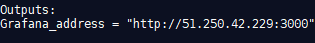

10. Перейдем по указанному адресу, введем стандартные учетные данные admin/admin123 и откроем дашборд ```Kubernetes / Compute Resources / Node (Pods)```:

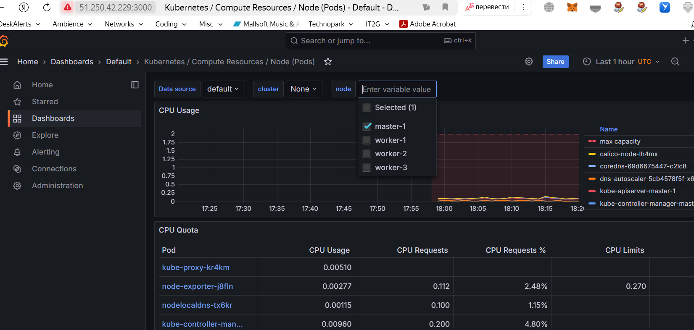

11. Проверим, какие ресурсы были созданы в Yandex Cloud:

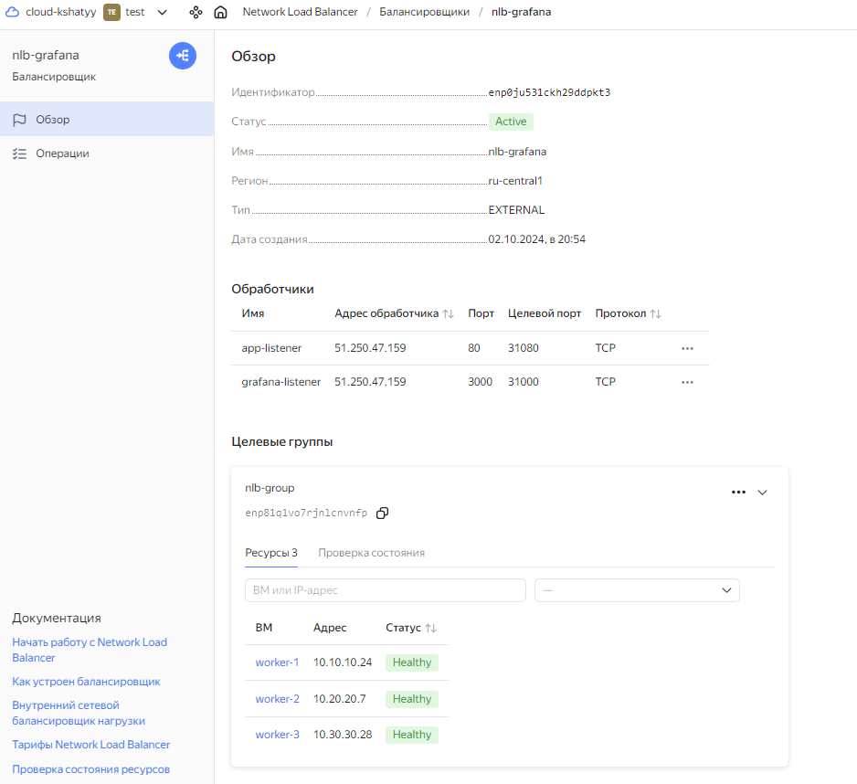


---
### Установка и настройка CI/CD

Осталось настроить ci/cd систему для автоматической сборки docker image и деплоя приложения при изменении кода.

Цель:

1. Автоматическая сборка docker образа при коммите в репозиторий с тестовым приложением.
2. Автоматический деплой нового docker образа.

Можно использовать [teamcity](https://www.jetbrains.com/ru-ru/teamcity/), [jenkins](https://www.jenkins.io/), [GitLab CI](https://about.gitlab.com/stages-devops-lifecycle/continuous-integration/) или GitHub Actions.

Ожидаемый результат:

1. Интерфейс ci/cd сервиса доступен по http.
2. При любом коммите в репозиторие с тестовым приложением происходит сборка и отправка в регистр Docker образа.
3. При создании тега (например, v1.0.0) происходит сборка и отправка с соответствующим label в регистри, а также деплой соответствующего Docker образа в кластер Kubernetes.


### Решение:

1. Создание необходимых секретов в репозитории my-diplom:

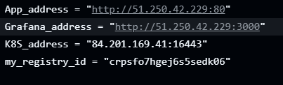

2. Настроим workflow для CI/CD с помощью Terraform:

```
name: Terraform CI/CD

on:
 push:
   branches:
     - main

env:
  YA_ACCESS_KEY_ID: ${{ secrets.YA_ACCESS_KEY_ID }}
  YA_SECRET_ACCESS_KEY: ${{ secrets.YA_SECRET_ACCESS_KEY }}
  TF_VAR_access_key: ${{ secrets.TF_VAR_access_key }}
  TF_VAR_secret_key: ${{ secrets.TF_VAR_secret_key }}
  TF_VAR_account_id: ${{ secrets.TF_VAR_account_id }}
  TF_VAR_cloud_id: ${{ secrets.TF_VAR_cloud_id }}
  TF_VAR_folder_id: ${{ secrets.TF_VAR_folder_id }}
  TF_VAR_default_zone: ${{ secrets.TF_VAR_default_zone }}
  ANSIBLE_SSH_PRIVATE_KEY: ${{ secrets.ANSIBLE_SSH_PRIVATE_KEY }}
  ANSIBLE_SSH_PUBLIC_KEY: ${{ secrets.ANSIBLE_SSH_PUBLIC_KEY }}

jobs:
  terraform:
    runs-on: ubuntu-22.04

    steps:
    - name: Checkout repository
      uses: actions/checkout@v4

    - name: Setup Terraform
      uses: hashicorp/setup-terraform@v3

    - name: Create service account key file
      run: |
        mkdir -p ~/.ssh
        echo "${{ secrets.SERVICE_IAM_KEY }}" | base64 --decode > ~/.ssh/service-iam.json

    - name: Set up SSH
      run: |
        mkdir -p ~/.ssh
        echo "${{ env.ANSIBLE_SSH_PRIVATE_KEY }}" > ~/.ssh/id_rsa
        chmod 600 ~/.ssh/id_rsa
        echo "${{ env.ANSIBLE_SSH_PUBLIC_KEY }}" > ~/.ssh/id_rsa.pub
        chmod 600 ~/.ssh/id_rsa.pub

    - name: Terraform Init
      working-directory: terraform
      run: terraform init
      
    - name: Terraform Validate
      working-directory: terraform
      run: terraform validate
     
    - name: Terraform Plan
      working-directory: terraform
      run: terraform plan
      
    - name: Terraform Apply
      working-directory: terraform
      run: terraform apply -auto-approve

    - name: Get terraform output in yml
      working-directory: terraform
      run: |
        terraform output -json > ../k8s/tf_outputs.json
        jq -r 'to_entries | map(.key + ": " + .value.value) | .[]' ../k8s/tf_outputs.json > ../k8s/tf_outputs.yml

    - name: Install GitHub CLI
      run: |
        sudo apt-get install gh

    - name: Login to GitHub
      env:
        PAT: ${{ secrets.GIT_ACCESS_TOKEN }}
      run: |
        echo "$PAT" | gh auth login --with-token

    - name: Set secret in another repository
      run: |
        my_registry_id=$(grep 'my_registry_id:'  k8s/tf_outputs.yml | cut -d ' ' -f 2)
        echo $my_registry_id
        gh secret set MY_REGISTRY_ID --body $my_registry_id --repo kshatyy/my-diplom-app
        K8S_address=$(grep 'K8S_address:'  k8s/tf_outputs.yml | cut -d ' ' -f 2)
        sed -i "s/127.0.0.1:6443/$K8S_address/g" k8s/kube-config
        kube_config=$(base64 < k8s/kube-config | tr -d '\n' | sed -e 's/^[ \t]*//' -e 's/[ \t]*$//')
        gh secret set KUBE_CONFIG --body $kube_config --repo kshatyy/my-diplom-app
```

4. Проверка работы пайплайна:

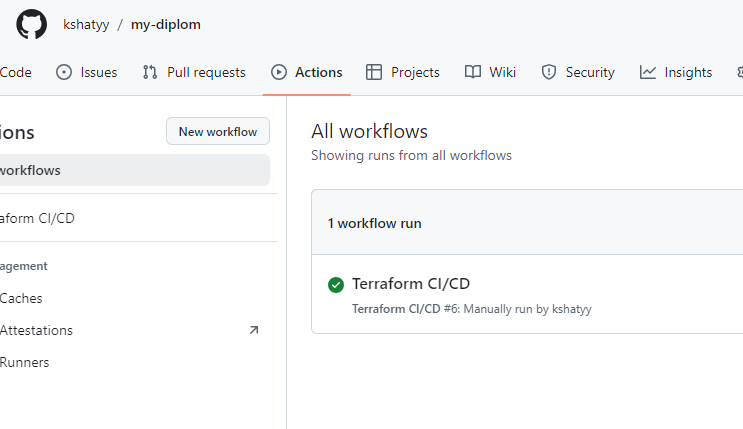

5. Создание секретов в репозитории my-diplom-app:

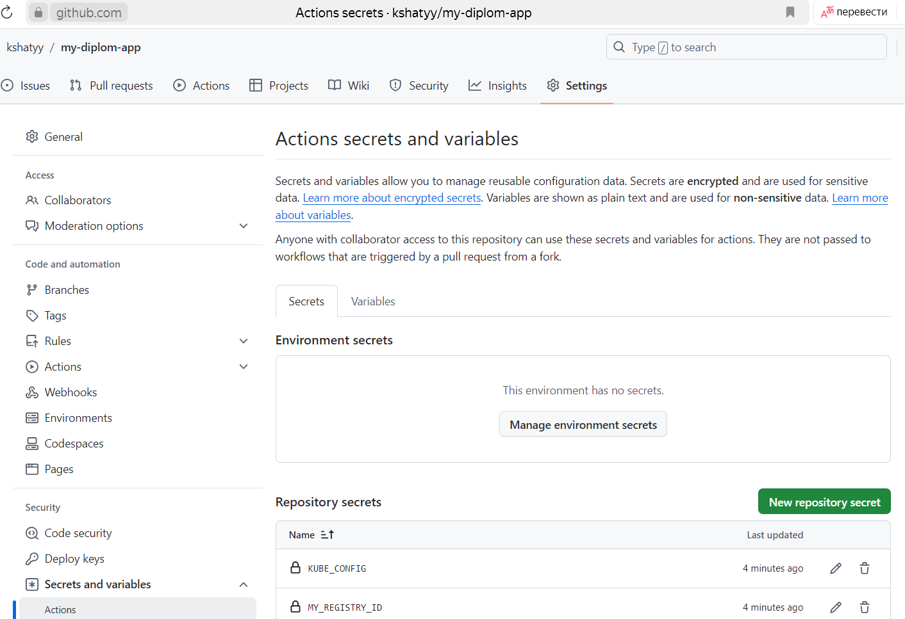

6. Определим pipeline для CI Docker образов:

```
name: Docker Image CI
on:
  push:
    tags:
      - 'v*'

env:
  MY_REGISTRY_ID: ${{ secrets.MY_REGISTRY_ID }}

jobs:
  build:
    runs-on: ubuntu-latest
    steps:
    - uses: actions/checkout@v4
    - name: Build and push Docker image with tag
      uses: docker/build-push-action@v6
      with:
        context: .
        push: true
        tags: |
          cr.yandex/${{ env.MY_REGISTRY_ID }}/nginx:${{ github.ref_name }}
          cr.yandex/${{ env.MY_REGISTRY_ID }}/nginx:latest
    
    - name: Update Deployment YAML
      run: |
        sed -i "s/repository-id/${{ env.MY_REGISTRY_ID }}/g" ./k8s/app-deployment.yml
        sed -i "s/\:latest/\:${{ github.ref_name }}/g" ./k8s/app-deployment.yml

    - name: Setup Kubernetes
      uses: azure/setup-kubectl@v4
      with:
        version: 'latest' 

    - name: Configure kubectl
      run: |
        echo "${{ secrets.KUBE_CONFIG }}" | base64 --decode > config
        chmod 600 config


    - name: Deploy to Kubernetes
      run: |
        kubectl --kubeconfig=config --insecure-skip-tls-verify apply -f ./k8s/app-deployment.yml
        kubectl --kubeconfig=config --insecure-skip-tls-verify apply -f ./k8s/app-service.yml
        kubectl --kubeconfig=config --insecure-skip-tls-verify apply -f ./k8s/app-networkpolicy.yml
```

7. Проверка работы пайплайна:

```
name: Docker Image CI
on:
  push:
    tags:
      - 'v*'

env:
  MY_REGISTRY_ID: ${{ secrets.MY_REGISTRY_ID }}

jobs:
  build:
    runs-on: ubuntu-latest
    steps:
    - uses: actions/checkout@v4
    - name: Build and push Docker image with tag
      uses: docker/build-push-action@v6
      with:
        context: .
        push: true
        tags: |
          cr.yandex/${{ env.MY_REGISTRY_ID }}/nginx:${{ github.ref_name }}
          cr.yandex/${{ env.MY_REGISTRY_ID }}/nginx:latest
    
    - name: Update Deployment YAML
      run: |
        sed -i "s/repository-id/${{ env.MY_REGISTRY_ID }}/g" ./k8s/app-deployment.yml
        sed -i "s/\:latest/\:${{ github.ref_name }}/g" ./k8s/app-deployment.yml

    - name: Setup Kubernetes
      uses: azure/setup-kubectl@v4
      with:
        version: 'latest' 

    - name: Configure kubectl
      run: |
        echo "${{ secrets.KUBE_CONFIG }}" | base64 --decode > config
        chmod 600 config


    - name: Deploy to Kubernetes
      run: |
        kubectl --kubeconfig=config --insecure-skip-tls-verify apply -f ./k8s/app-deployment.yml
        kubectl --kubeconfig=config --insecure-skip-tls-verify apply -f ./k8s/app-service.yml
        kubectl --kubeconfig=config --insecure-skip-tls-verify apply -f ./k8s/app-networkpolicy.yml
```

---

## Ссылки на конфигурационные файлы:

<table>
<tr>
<td>

## Репозиторий my-diplom

- [terraform-prepare](https://github.com/kshatyy/my-diplom/tree/main/terraform)
- [terraform](https://github.com/kshatyy/my-diplom/tree/main/terraform)
- [ansible](https://github.com/kshatyy/my-diplom/tree/main/ansible)
- [docker](https://github.com/kshatyy/my-diplom/tree/main/docker)
- [k8s](https://github.com/kshatyy/my-diplom/tree/main/k8s)
- [pipeline](https://github.com/kshatyy/my-diplom/blob/main/.github/workflows/terraform.yml)

</td>
<td>

## Репозиторий my-diplom-app

- [Dockerfile](https://github.com/kshatyy/my-diplom-app/blob/main/Dockerfile)
- [index.html](https://github.com/kshatyy/my-diplom-app/blob/main/index.html)
- [k8s](https://github.com/kshatyy/my-diplom-app/tree/main/k8s)
- [pipeline](https://github.com/kshatyy/my-diplom-app/blob/main/.github/workflows/docker-image-ci.yml)
<p> </p>
<p> </p>
  
</td>
</tr>
</table>

---

В результате проведенной работы, при каждом коммите в ветку main репозитория my-diplom автоматически разворачиваются следующие ресурсы:

1. Инфраструктура в Yandex Cloud
2. Кластер Kubernetes
3. Система мониторинга
4. Создание и развертывание приложения в реестре Yandex Cloud
5. Запуск приложения в кластере Kubernetes
6. Передача данных в секреты репозитория my-diplom-app

В репозитории my-diplom-app, при создании нового тега происходит сборка и отправка образа с тегом в реестр приложения, а также развертывание соответствующего приложения в Kubernetes.

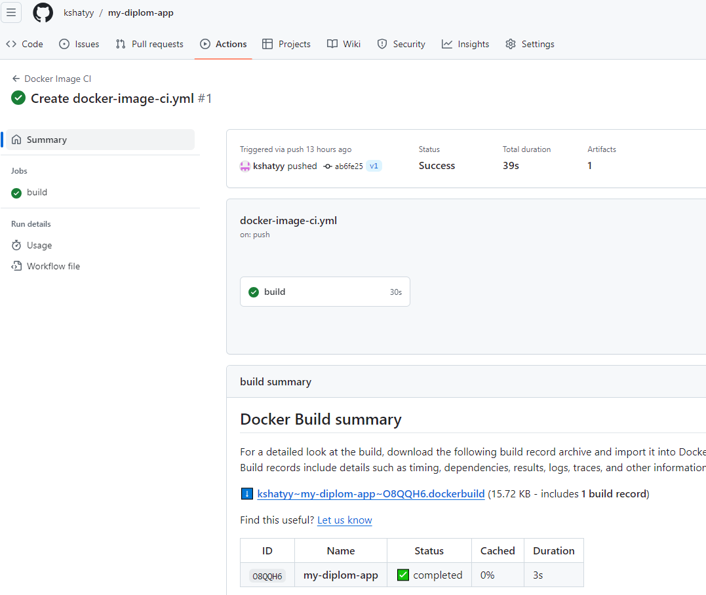


Начальное состояние выглядит следующим образом:

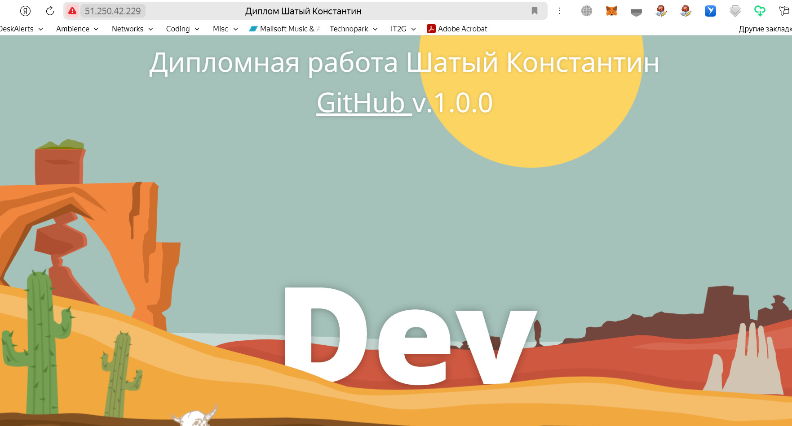

После изменения тега на v1.0.0 и обновления страницы через минуту, мы получаем:

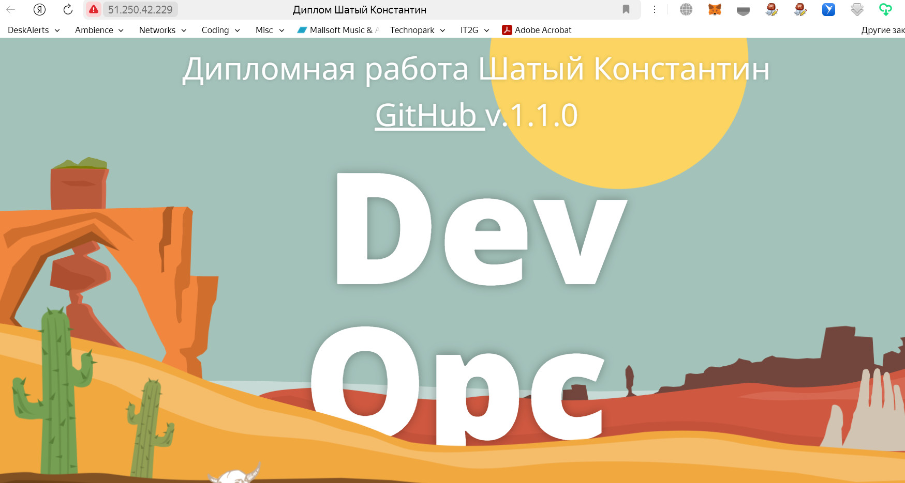


Также обновляется интерфейс Grafana:

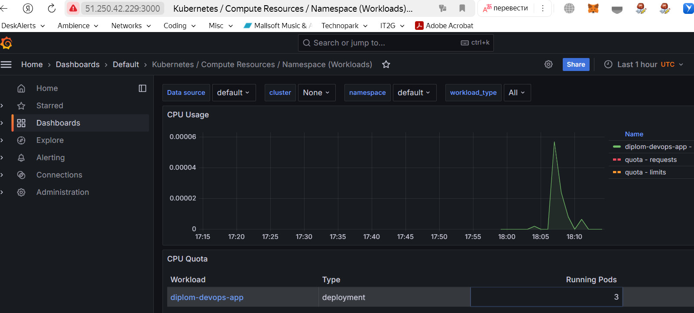

---
### Ссылки на ресурсы:

[Интерфейс Grafana](http://51.250.42.229:3000)

[Приложение](http://51.250.42.229:80)


---
## Что необходимо для сдачи задания?

1. Репозиторий с конфигурационными файлами Terraform и готовность продемонстрировать создание всех ресурсов с нуля.
2. Пример pull request с комментариями созданными atlantis'ом или снимки экрана из Terraform Cloud или вашего CI-CD-terraform pipeline.
3. Репозиторий с конфигурацией ansible, если был выбран способ создания Kubernetes кластера при помощи ansible.
4. Репозиторий с Dockerfile тестового приложения и ссылка на собранный docker image.
5. Репозиторий с конфигурацией Kubernetes кластера.
6. Ссылка на тестовое приложение и веб интерфейс Grafana с данными доступа.
7. Все репозитории рекомендуется хранить на одном ресурсе (github, gitlab)
